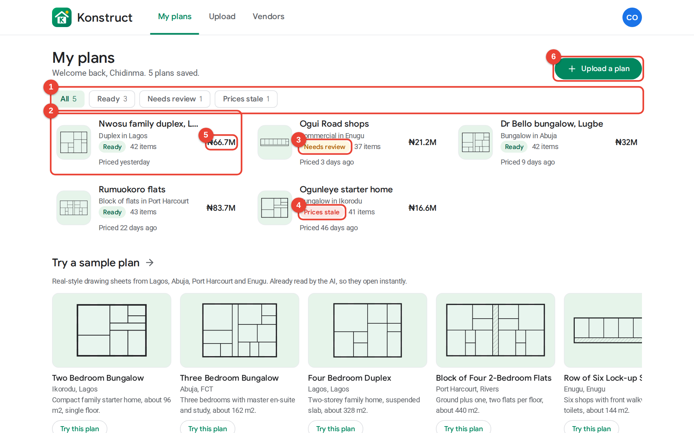

# Konstruct

Upload a building plan and get a priced material list, plus the phone numbers of vendors near your site.

**Live:** https://konstruct-production-c62c.up.railway.app
**Demo login:** `demo@konstruct.ng` / `demo1234` (already filled in on the sign-in page)
**Full documentation:** [docs/Konstruct-Documentation.pdf](docs/Konstruct-Documentation.pdf)



## Features

- Upload a plan (PDF, PNG, JPG or WEBP, up to 8 MB), or try one of five sample drawing sheets from Lagos, Abuja, Port Harcourt and Enugu.
- **One AI call per file.** The model only measures: it returns materials and quantities as strict JSON. Answers are cached by file hash, so the same file is never sent twice.
- Material breakdown in Naira across 11 categories (cement, sand and granite, blocks, rods, timber, roofing, doors and windows, tiles, paint, plumbing, electrical) with a 10% contingency.
- 34 vendors in 8 Nigerian cities, ranked by distance (same city, then state, then region), price and rating, with call and WhatsApp buttons.
- Plan statuses: Ready, Needs review (a line has no price or was hard to measure), Prices stale (priced over 30 days ago, refresh with one tap).
- Edit any quantity, price items that are not in the catalog, refresh prices, delete plans.
- Professional PDF estimate: quote reference, bill of materials, totals, vendor contacts, assumptions.
- Google Play Store look, works on phones (bottom navigation, tap-to-call).

## Stack

Next.js 16 (App Router, Server Components, Server Actions) with TypeScript strict, PostgreSQL with Drizzle ORM and drizzle-kit migrations, Zod, bcryptjs with a jose JWT in an HTTP-only cookie, OpenRouter (`google/gemini-3.8-flash`), @react-pdf/renderer, lucide-react, DiceBear, @fontsource (Google Sans, Roboto), Vitest and Playwright.

## Quick start

```bash
service postgresql start && pg_isready
createdb konstruct && createdb konstruct_test && createdb konstruct_e2e

cp .env.example .env      # set DATABASE_URL, SESSION_SECRET, OPENROUTER_API_KEY
npm install
npm run db:migrate
npm run db:seed
npm run dev               # http://localhost:3000
```

Set `KONSTRUCT_TODAY=2026-10-04` to pin "today" for demos. Set `KONSTRUCT_AI_MODE=mock` to run without an API key (the sample plans still work in any mode because their AI answers are cached).

## Scripts

| Script | What it does |
| --- | --- |
| `npm run dev` / `build` / `start` | Develop, build, run in production |
| `npm run lint` / `typecheck` | ESLint, route type generation and `tsc` |
| `npm run db:generate` | Create a SQL migration from schema changes |
| `npm run db:migrate` | Apply migrations |
| `npm run db:seed` / `db:reset` | Seed demo data dated relative to today / wipe and reseed |
| `npm test` | Unit and integration tests (Vitest, real Postgres) |
| `npm run test:e2e` | Playwright on desktop and a Pixel 7 profile (run `npm run build` first) |
| `npm run samples:make` | Re-render the five sample plan PDFs |
| `npm run samples:extract` | Send the samples through the real AI once and store the answers |
| `npm run docs:pdf` | Rebuild `docs/Konstruct-Documentation.pdf` with fresh screenshots |

## Tests

81 tests, all passing: 52 unit, 15 integration, 13 end-to-end on desktop and 1 on mobile.

## Deployment

Railway project `school-projects`: service `konstruct` (built from this repository) and `Postgres-moRa`. `railway.json` builds with `npm run build`, then on start runs migrations, seeds only if the database is empty, and starts Next on `0.0.0.0`. The health check at `/api/health` also pings the database.

## Notes

Vendor markets, areas and brands are real. Business names and phone numbers are demo listings and must be replaced with verified vendors before real use. Estimates cover materials only, not labour, transport or VAT.
